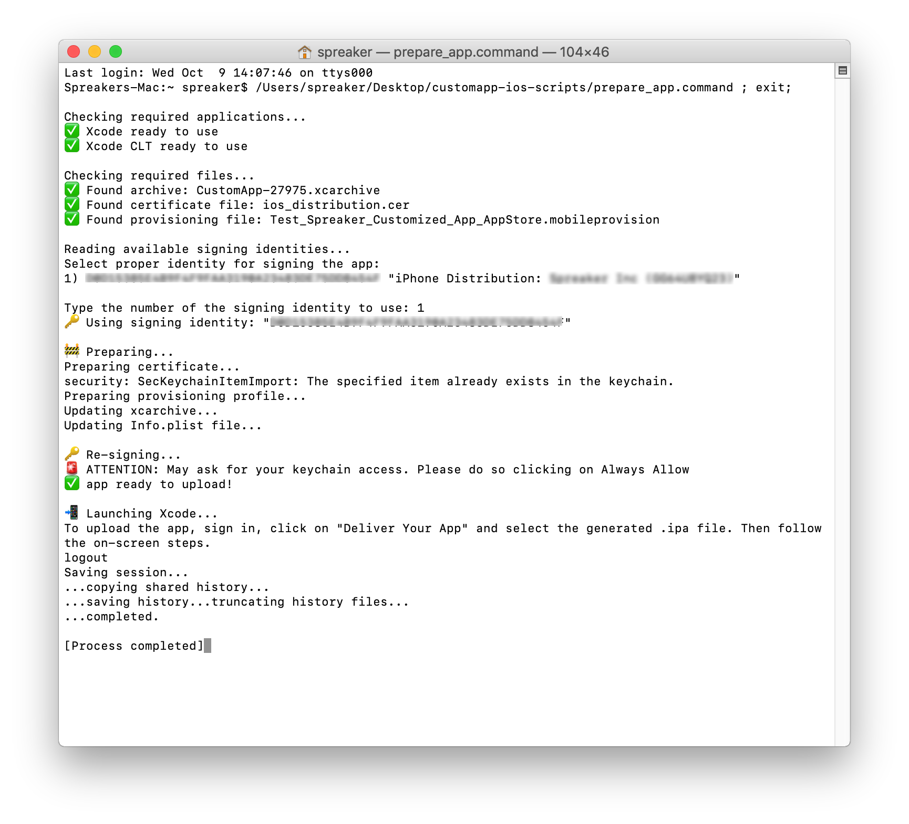

# Spreaker Customized App for iOS

More information:
http://www.spreaker.com/store/app

## How to sign an app with your distribution certificate

Before uploading your brand new app to the App Store, you'll need to sign in with your distribution certificate. The `prepare_app.command` script is here, just for that!

If you need help or have any questions, please visit http://help.spreaker.com.

### Requirements

#### Software:
* XCode (latest version)
* XCode Command line Tools (latest version)
* Application Loader (it's inside Xcode)
* Terminal

#### App in iTunes Connect:
* You need to set up an app in the iTunes Connect portal. You can use any bundle ID you like (we suggest something like `com.yourname.Spreaker-Customized-App`).
In order to upload the .ipa with Application Loader, the app MUST be in the "Prepare for Submission" state.

#### Certificate and Provisioning Profile:
* An App Store Distribution Provisioning Profile (a .mobileprovision file).
* The certificate (with its private key) in your keychain, in order to use the distribution profile above.
* The certificate identity name.

## Run prepare_app.command

In order to execute script, put all the files involved (`.xcarchive`, `prepare_app.command` and `.mobileprovision` files) in the same folder.

The `prepare_app.command` script requires 3 things:

 1. The `.xcarchive` file we provided you.
 2. The developer identity name needed when using the provisioning profile.
 3. The `.mobileprovision` file itself.

Once you launch the script, it will looks for those two files in the current directory and will prompt you to choose which developer identity use for signing.

#### Get required files

To get the `.mobileprovision`, simply visit the [iTunes Connect Portal](https://developer.apple.com/account/ios/profile/profileList.action) and download the *App Store Distribution Provisioning Profile* related to this app.

If needed, create it from scratch. There are no restrictions regarding the app bundle ID to use. Feel free to create whatever you wish.
Remember to move/copy the `.mobileprovision` file into the script folder.

#### Launch the script 

Double click on `prepare_app.command` to execute it.

The script will ask you to allow `codesign` software to access your keychain (in order to use the distribution certificate). 

In a few seconds, the script completes its work and you'll find a new `.ipa` file in the folder.

* The script will also opens the `Application Loader` for you, so you can upload the `.ipa` file generated strait away.

## License

Copyright (c) 2015 Spreaker, Inc. See the LICENSE file for license rights and limitations (MIT).
